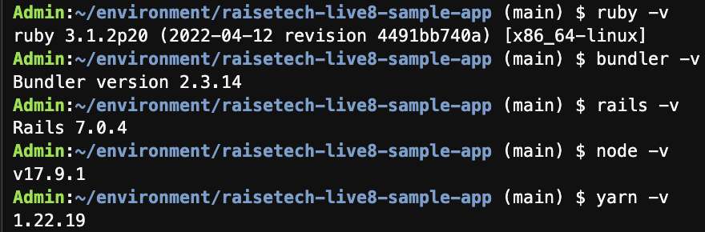
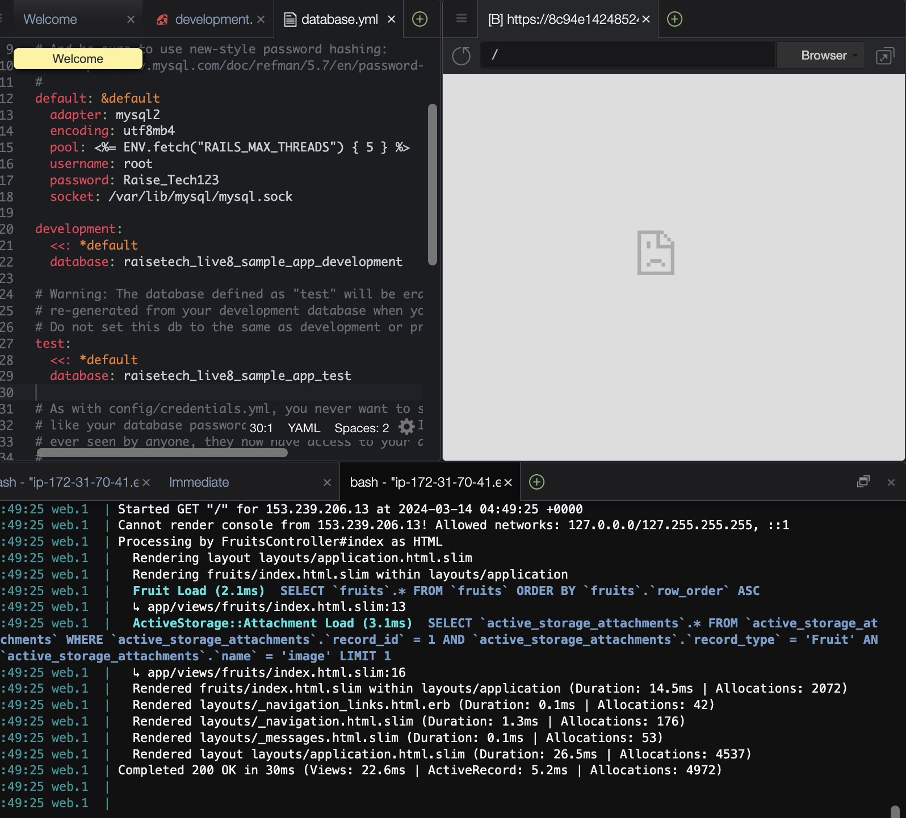
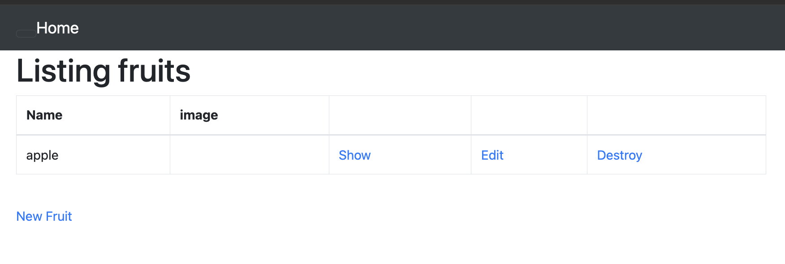
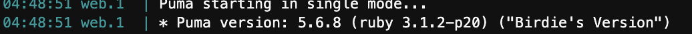
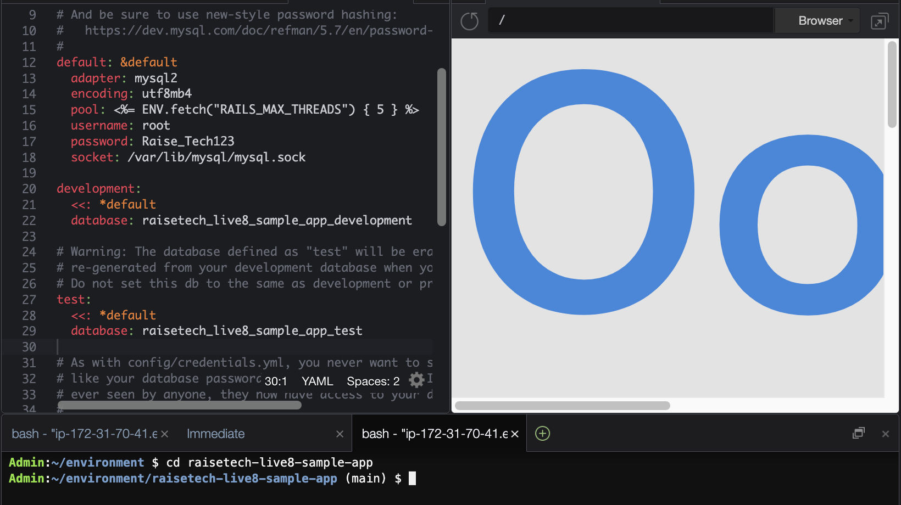
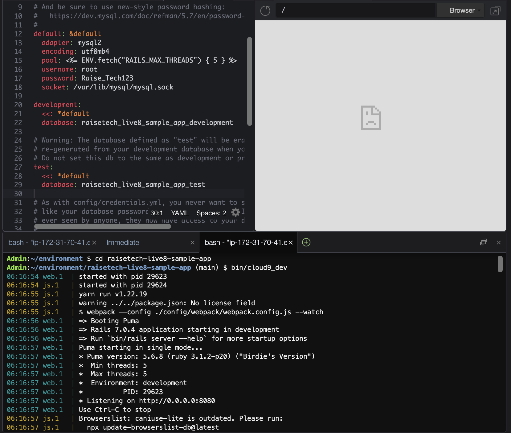
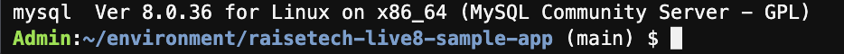
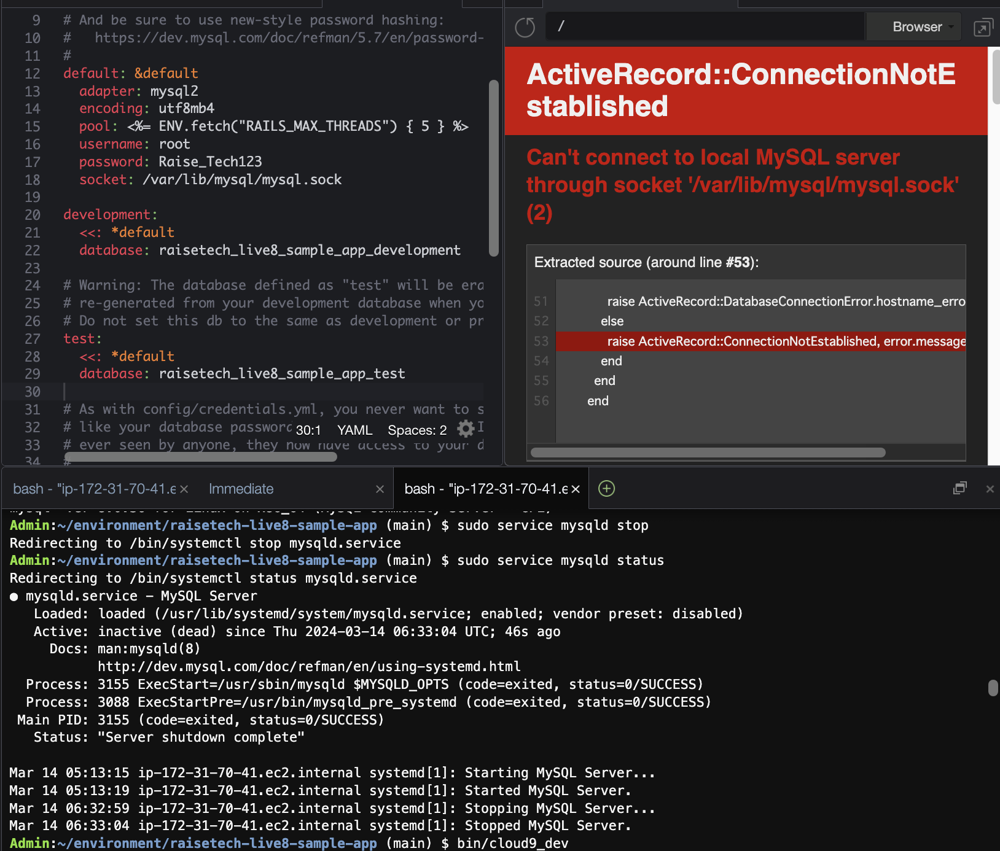
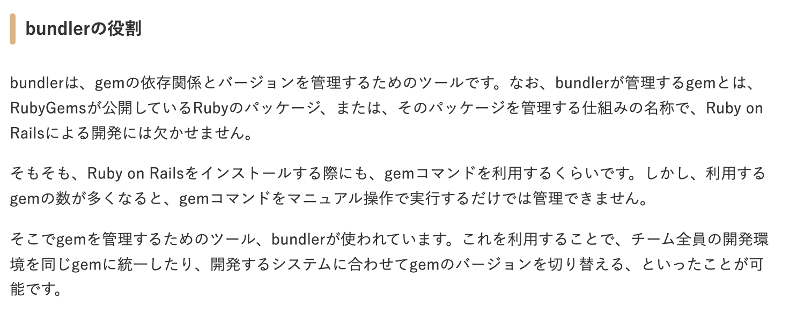

# 第3回課題

## デプロイ
- バージョン確認

- サーバー起動

- アクセス先

## APサーバー
- APサーバー名とバージョン：Puma version: 5.6.8 (ruby 3.1.2-p20) ("Birdie's Version")

- AP サーバーを終了させた場合、引き続きアクセスできますか
→アクセス不可

- 結果を確認して、また AP サーバーを起動してください。

## DBサーバー
- DBサーバー名とバージョン：mysql  Ver 8.0.36 for Linux on x86_64 (MySQL Community Server - GPL)

- DB サーバーを終了させた場合、引き続きアクセスできますか
→アクセス不可

- Rails の構成管理ツールの名前は何でしたか？
→bundler

## 今回の課題から学んだこと感じたこと
今までコマンドを打って実行させていたのでどのようなものが構成されていたか把握する機会になった。