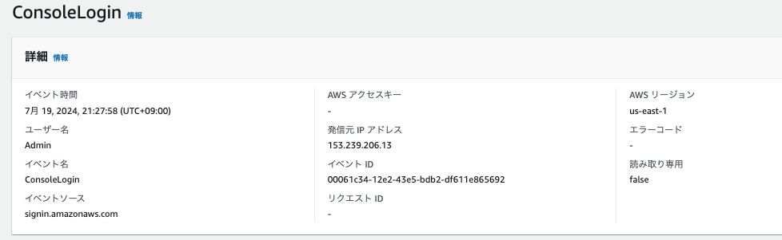
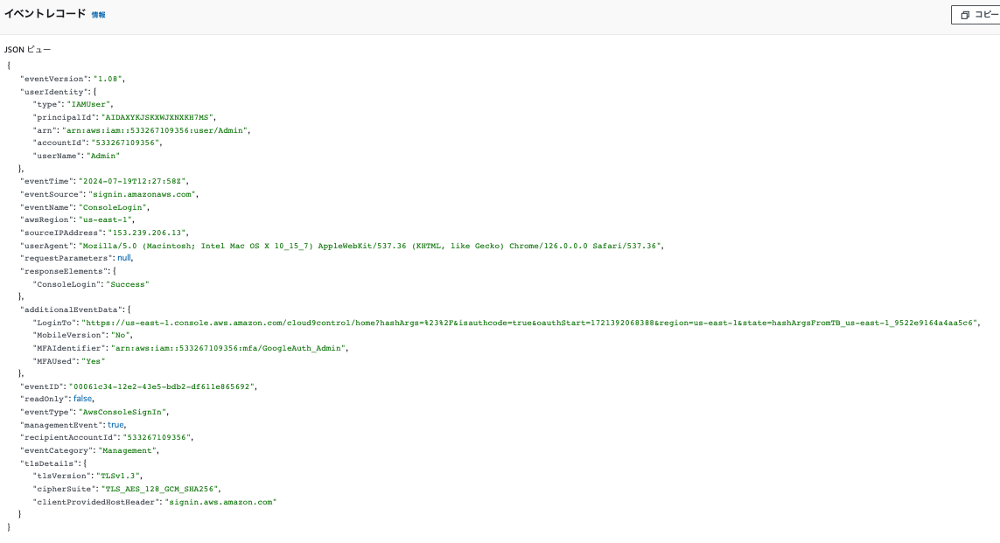
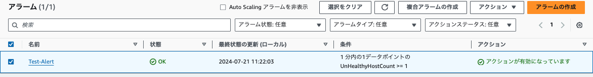
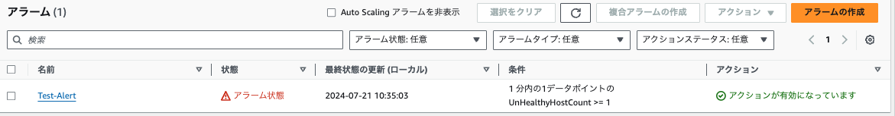
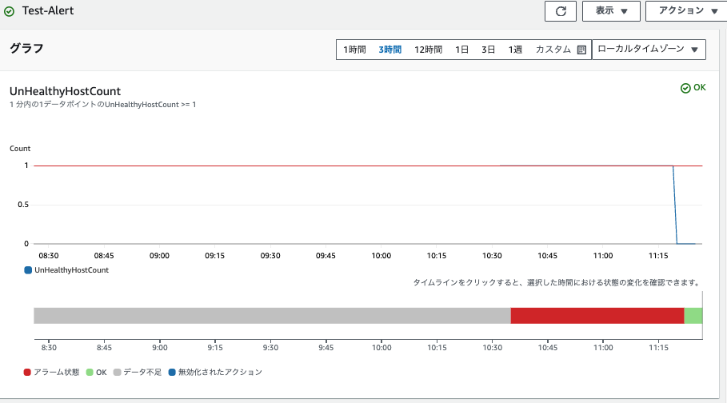
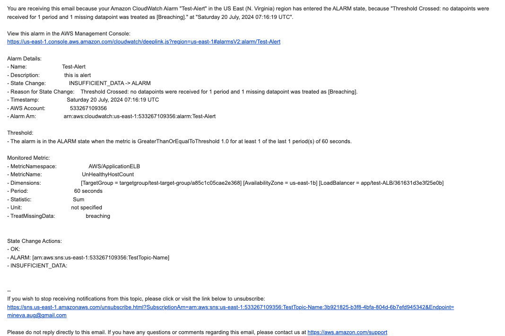
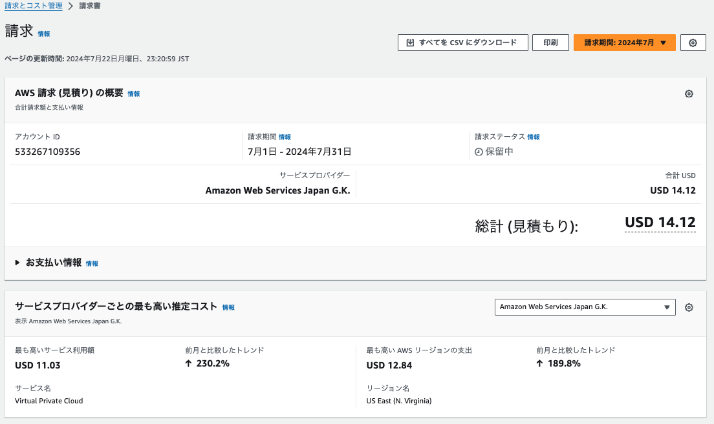
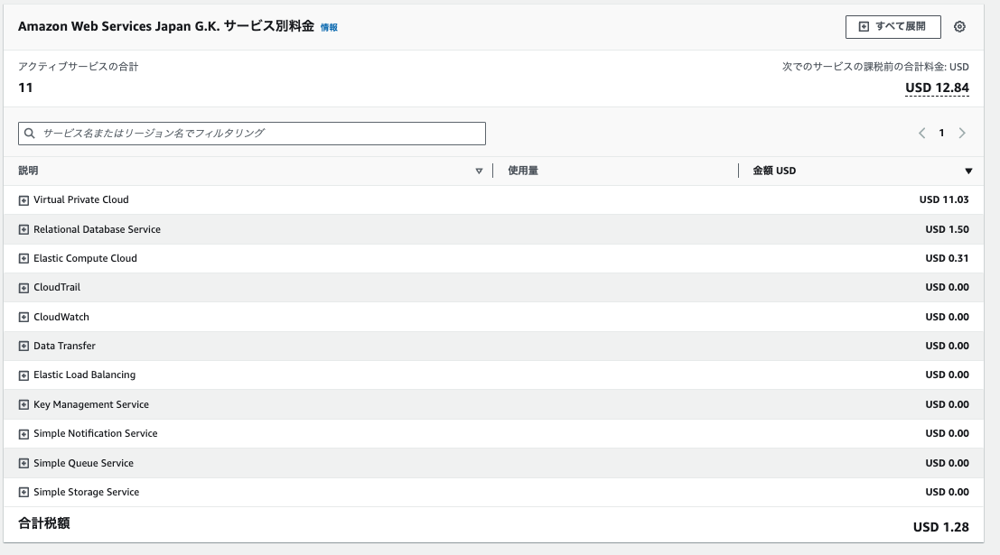

# 第6回課題

## CloudTrail
### 含まれる内容3つ（イベント時間・イベント名・イベントソース）
- イベント時間 7月 19, 2024, 21:27:58 (UTC+09:00)
- イベント名 ConsoleLogin
- イベントソース signin.amazonaws.com

## アラート
- アプリ起動の状態

- アプリ停止の状態

- アラートグラフ

- アラート受信メール

## 費用
- 現在の利用料

- 現在の利用料（内訳）

- AWS Pricing Calculatorを使用した見積もり
https://calculator.aws/#/estimate?id=b73fa9660f7d837210d9ea2de3597daeb4f41d23