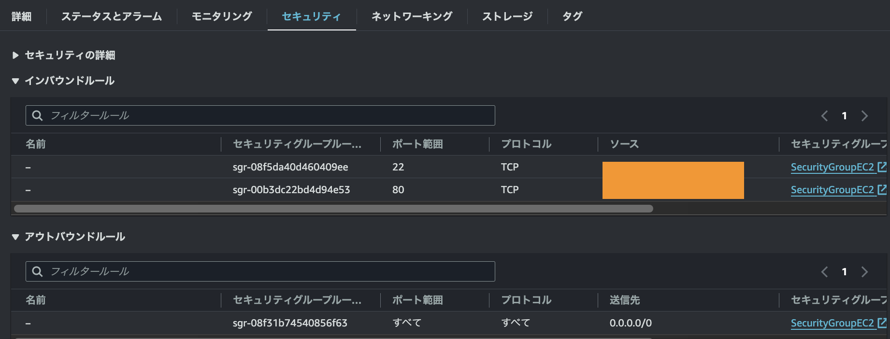

# 第10回課題

## 作成したテンプレートファイル
- [アプリケーション関連](Template/Application_Layer.yml)
- [セキュリティ関連](Template/Security_Layer.yml)
- [ネットワーク関連](Template/Network_Layer.yml)

## VPC
- VPC

## EC2
- EC2-1

- EC2-2

- EC2-3

## ALB
- ALB-1

- ALB-2

## RDS
- RDS-1

- RDS-2

## S3
- S3

## 接続確認
- EC2

- RDS

## 感想
- 記述無しでもデフォルトで設定されるものなど、改めて気づけたものがあった。
- 今回はLayerごとに分けてテンプレートを作成したが、色々な見方があるので留意しておきたい。