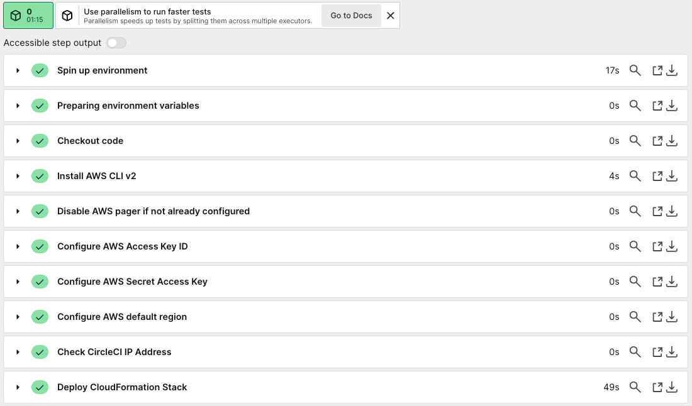
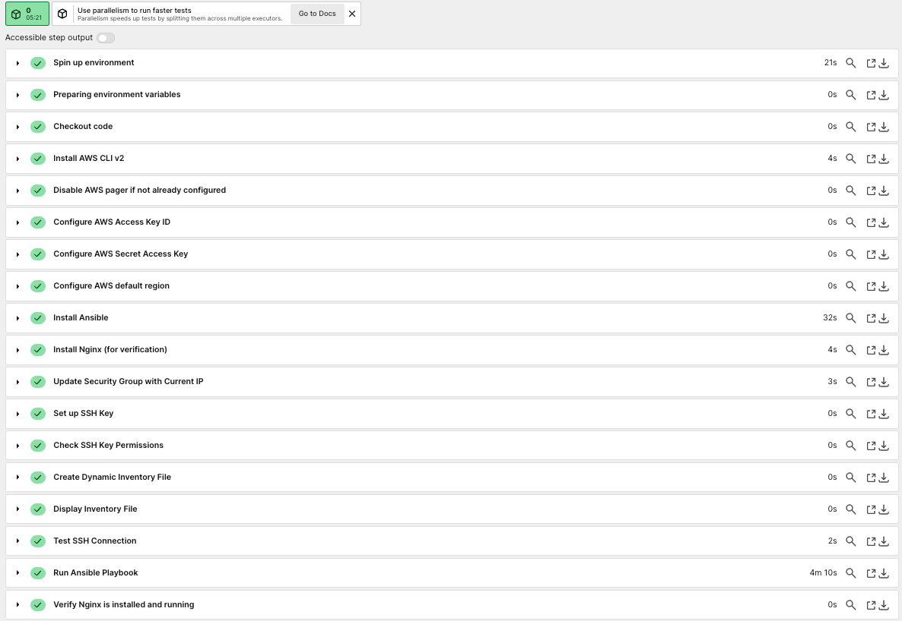
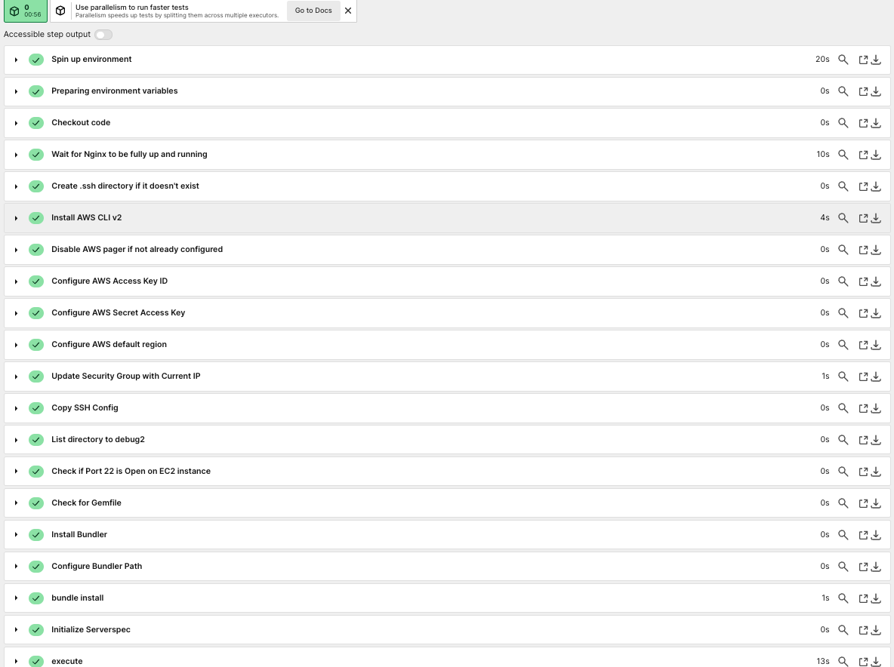
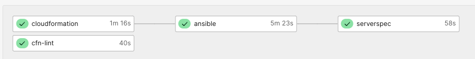
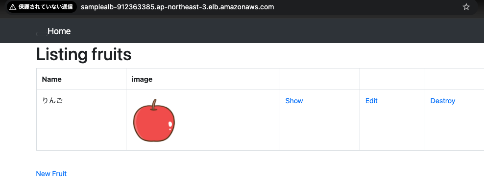

# 第13回課題

### CircleCIにCloudFormationやServerSpec、Ansibleの処理を加えて実行 
* CircleCIのコンソールにて、環境変数を設定（設定例） 
- AWS_ACCESS_KEY_ID(アクセスキー) 
- AWS_SECRET_ACCESS_KEY(シークレットアクセスキー) 
- AWS_DEFAULT_REGION(リージョン) 
- AWS_DB_PW(RDSのパスワード)  

## CloudFormationのテンプレートを使用しスタックの作成 
* CircleCIにCloudFormationテンプレートを実行する処理 
  

## Ansible-Playbookの作成 
* CircleCIにAnsibleのPlaybookを実行する処理 
  

## Serverspecによるテスト実行 
* CircleCIにServerspecのテストを実行する処理   
  

## CircleCI結果（参考） 
  

## ALBのDNS名経由でアプリが正常に動作していることの確認 
  

※これまでの課題と別のリポジトリを作成し検証  
